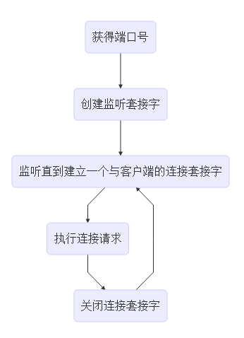
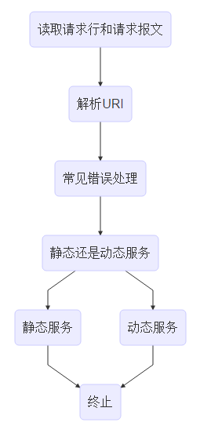

# 一个简单的Web服务器(迭代式、预线程式和线程池式三种方式)
## 迭代式(first分支)
### 主进程
 

### 执行连接请求
 

## 预线程式(second分支)
- 预线程模式类似于线程池
- 消费者-生产者的模式
- 预创建多个线程，相当于消费者,节约动态创建线程的负载。
- 服务器创建一个与客户端的连接等同于生产者产生一个消费项
- 线程处理一个连接等同于消费者消费一个消费项

## 线程池式(master分支)
- 预先创建线程池，线程池中线程堵塞
- 执行客户端请求时，线程池中相应线程进行处理

blog地址：http://codefarmer.me
